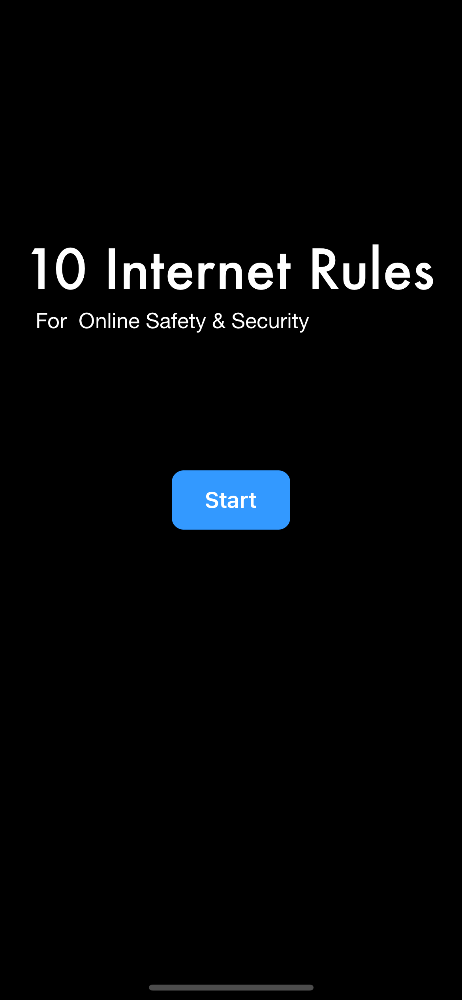
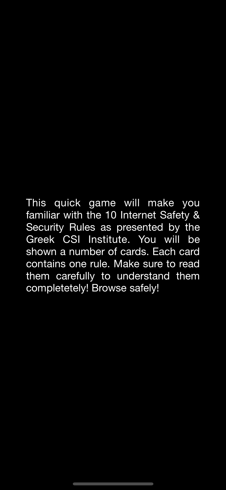
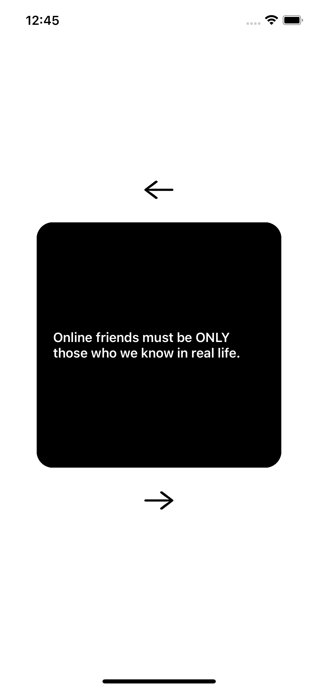
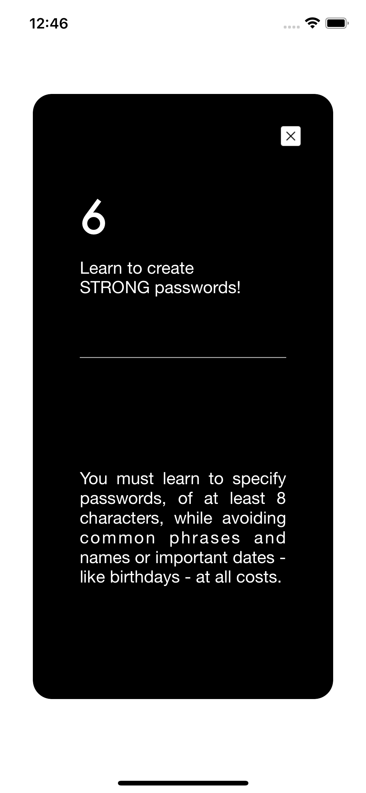

## Foodlink

An iOS application to teach and show the 10 Internet Safety Rules as described by the Greek Cyber Security International Institute. 

#### Technologies used: 
* UIKit 
* UIKit Animations
* JSON + Bundle Resources 
* Programmatic UI

#### Features: 
* Showing Internet Rules
* Swiping right to dismiss and left to show rule details.

#### Sample Screens 

    
    
     
    
    

